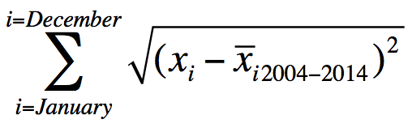

Coding dojo: tidyr,dplyr and ggplot
========================================================
author: 
date: 
autosize: true
width: 1440

Coding dojo challenge
========================================================
author: Etienne Low-Décarie
date: 

Challenge
========================================================

We are facing the third global mass bleaching event.

<iframe width="560" height="315" src="https://www.youtube.com/embed/gI6UPqFkJ0k" frameborder="0" allowfullscreen></iframe>

Challenge
========================================================

Try to predict locations or times of mass coral bleaching events using remotly sensed data available on Giovanni (1 long term average and one year of bleaching data provided), ReefBase data (a cleaned version of the bleaching data is provided) and data from published studies.

Some derived variables used to predict bleaching are provided in
Maina, J. et al., 2008. Modelling susceptibility of coral reefs to environmental stress using remote sensing data and GIS models. Ecological Modelling, 212(3-4), pp.180–199. http://linkinghub.elsevier.com/retrieve/pii/S0304380007005285

Challenge
========================================================
Test existing or creat a new bleaching index
  * Use giovanni temporal and/or spatial data (eg. sea surface temperature)
    * data for bleached and reference site available in data folder
  * Use reefbase bleaching occurence
    * data ready for R in data folder
  
Example index used:  
annual integrated temperature anomaly  

